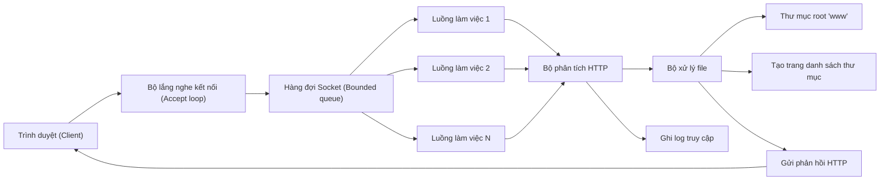
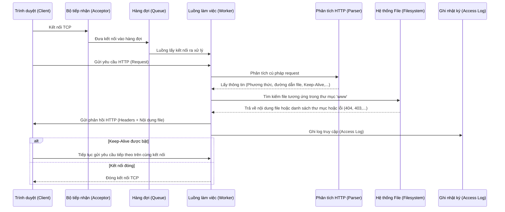

# Tổng quan dự án: System Programming HTTP File Server

Dự án này là một **Máy chủ phục vụ file tĩnh qua giao thức HTTP (HTTP Static File Server)** được viết bằng ngôn ngữ C sử dụng các thư viện hệ thống POSIX, hoạt động đa luồng (multi-threaded).

---

## 1. Kiến trúc hệ thống (System Architecture)

Dự án áp dụng mô hình **Producer-Consumer (Nhà sản xuất - Người tiêu dùng)** sử dụng một **Hàng đợi giới hạn (Bounded Queue)** và một **Nhóm luồng làm việc cố định (Fixed Thread Pool)** để đồng bộ hóa và xử lý kết nối.

### Sơ đồ luồng hoạt động:

* **Bộ lắng nghe kết nối (Listener):** Nhận kết nối TCP mới từ các Client gửi đến và đưa (enqueue) kết nối đó vào hàng đợi.
* **Hàng đợi Socket (Queue):** Lưu trữ tạm thời các socket kết nối đang chờ xử lý. Hàng đợi có giới hạn dung lượng để tránh quá tải hệ thống.
* **Nhóm luồng làm việc (Worker Threads):** Gồm một số lượng luồng cố định chạy song song. Các luồng này sẽ lấy (dequeue) kết nối từ hàng đợi ra để xử lý yêu cầu và trả về kết quả cho Client.

---

## 2. Quy trình xử lý yêu cầu (Request Lifecycle)

Mỗi yêu cầu từ trình duyệt được xử lý qua các bước tuần tự như sau:

---

## 3. Các tính năng chính của máy chủ

* **Keep-Alive:** Cho phép giữ kết nối TCP mở để tiếp tục nhận và xử lý nhiều yêu cầu tiếp theo từ cùng một Client mà không cần tốn thời gian thiết lập lại kết nối TCP mới.
* **MIME Types Lookup:** Tự động phát hiện định dạng file dựa trên đuôi mở rộng (ví dụ: `.html` -> `text/html`, `.png` -> `image/png`, `.css` -> `text/css`) để gửi kèm trong HTTP header, giúp trình duyệt của Client hiển thị đúng cách.
* **Directory Listing:** Nếu người dùng yêu cầu truy cập một thư mục (đường dẫn kết thúc bằng `/`), máy chủ tự động sinh ra một trang HTML chứa danh sách các file và thư mục con bên trong thư mục đó, đính kèm liên kết để người dùng nhấp vào xem/tải.
* **Byte-Range Requests (Tải một phần file):** Hỗ trợ phản hồi một phần dữ liệu của file (HTTP Status `206 Partial Content`). Hữu ích cho việc phát video/âm thanh trực tuyến (streaming) hoặc tiếp tục tải các file dung lượng lớn đang bị gián đoạn (resume download).
* **Bảo mật tránh lỗi Path Traversal:** Chuẩn hóa và làm sạch tất cả đường dẫn yêu cầu, chặn đứng các hành vi hack sử dụng ký tự đặc biệt như `../` hoặc `//` để truy cập trái phép ra ngoài thư mục gốc (`www/`).
* **Access Logging:** Ghi nhật ký truy cập của tất cả Client theo chuẩn chung **Common Log Format** (CLF) một cách an toàn giữa các luồng (thread-safe).

---

## 4. Các tệp tin cấu trúc mã nguồn chính (`src/`)

Bạn có thể tham khảo trực tiếp mã nguồn của các tính năng tại các file tương ứng:
* [main.c](file:///Ubuntu-24.04/home/duc/final_system_progamming/src/main.c): Hàm chính (`main`), tiếp nhận và xử lý cấu hình dòng lệnh (port, số luồng, giới hạn hàng đợi, file log), thiết lập các trình xử lý tín hiệu hệ thống (signal handling) để dừng máy chủ một cách an toàn.
* [server.c](file:///Ubuntu-24.04/home/duc/final_system_progamming/src/server.c): Khởi tạo socket lắng nghe, chạy vòng lặp chấp nhận kết nối TCP của Client và đưa vào hàng đợi.
* [thread_pool.c](file:///Ubuntu-24.04/home/duc/final_system_progamming/src/thread_pool.c): Khởi tạo luồng, lập trình hàng đợi giới hạn sử dụng biến điều kiện (`pthread_cond_t`) và khóa mutex (`pthread_mutex_t`) để đồng bộ việc nạp/lấy kết nối.
* [http.c](file:///Ubuntu-24.04/home/duc/final_system_progamming/src/http.c): Đọc yêu cầu HTTP thô từ socket và phân tích cấu trúc của request line và headers.
* [files.c](file:///Ubuntu-24.04/home/duc/final_system_progamming/src/files.c): Định vị file vật lý tương ứng trên ổ cứng, kiểm tra tính an toàn của đường dẫn, tìm kiếm MIME type tương ứng, và sinh mã HTML danh sách thư mục khi cần.
* [log.c](file:///Ubuntu-24.04/home/duc/final_system_progamming/src/log.c): Xử lý mở, ghi log đồng bộ đa luồng và đóng file log an toàn.
