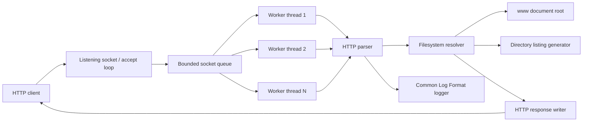
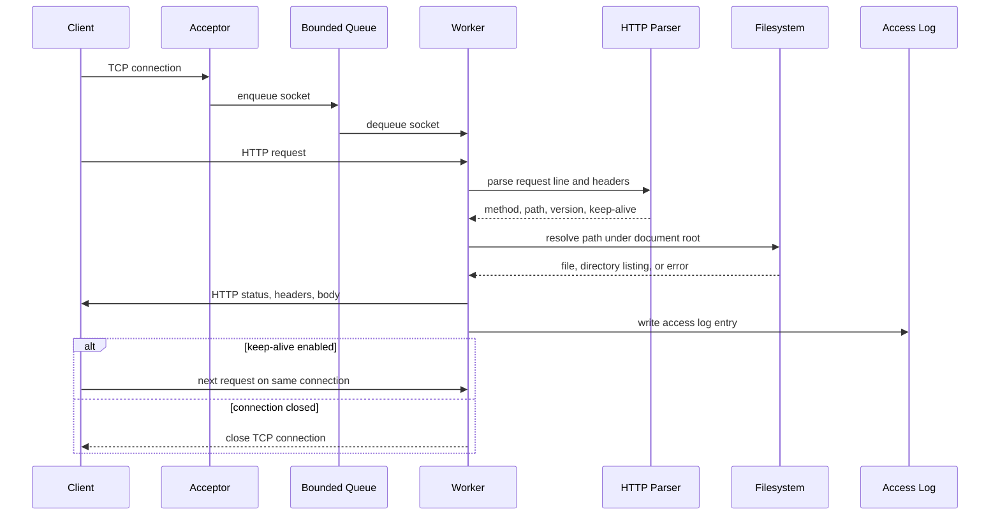

# Diagrams

## System Architecture

```mermaid
flowchart LR
    Client["HTTP client"] --> Listener["Listening socket / accept loop"]
    Listener --> Queue["Bounded socket queue"]
    Queue --> WorkerA["Worker thread 1"]
    Queue --> WorkerB["Worker thread 2"]
    Queue --> WorkerN["Worker thread N"]
    WorkerA --> Parser["HTTP parser"]
    WorkerB --> Parser
    WorkerN --> Parser
    Parser --> Files["Filesystem resolver"]
    Files --> DocRoot["www document root"]
    Files --> Listing["Directory listing generator"]
    Parser --> Logger["Common Log Format logger"]
    Files --> Response["HTTP response writer"]
    Response --> Client
```

## Request Lifecycle

```mermaid
sequenceDiagram
    participant C as Client
    participant A as Acceptor
    participant Q as Bounded Queue
    participant W as Worker
    participant H as HTTP Parser
    participant F as Filesystem
    participant L as Access Log

    C->>A: TCP connection
    A->>Q: enqueue socket
    Q->>W: dequeue socket
    C->>W: HTTP request
    W->>H: parse request line and headers
    H-->>W: method, path, version, keep-alive
    W->>F: resolve path under document root
    F-->>W: file, directory listing, or error
    W->>C: HTTP status, headers, body
    W->>L: write access log entry
    alt keep-alive enabled
        C->>W: next request on same connection
    else connection closed
        W-->>C: close TCP connection
    end
```
