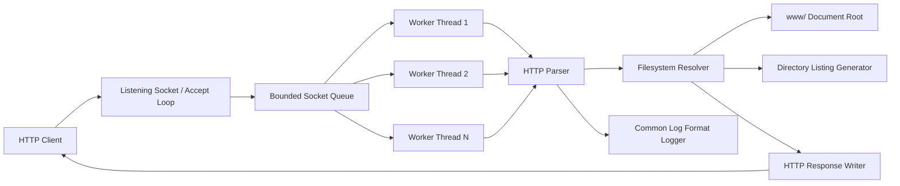
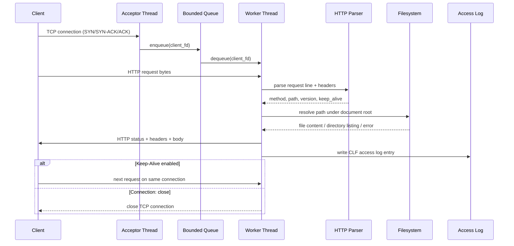
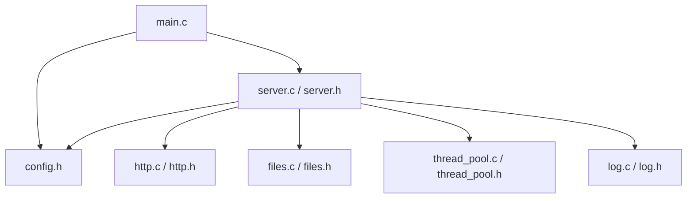
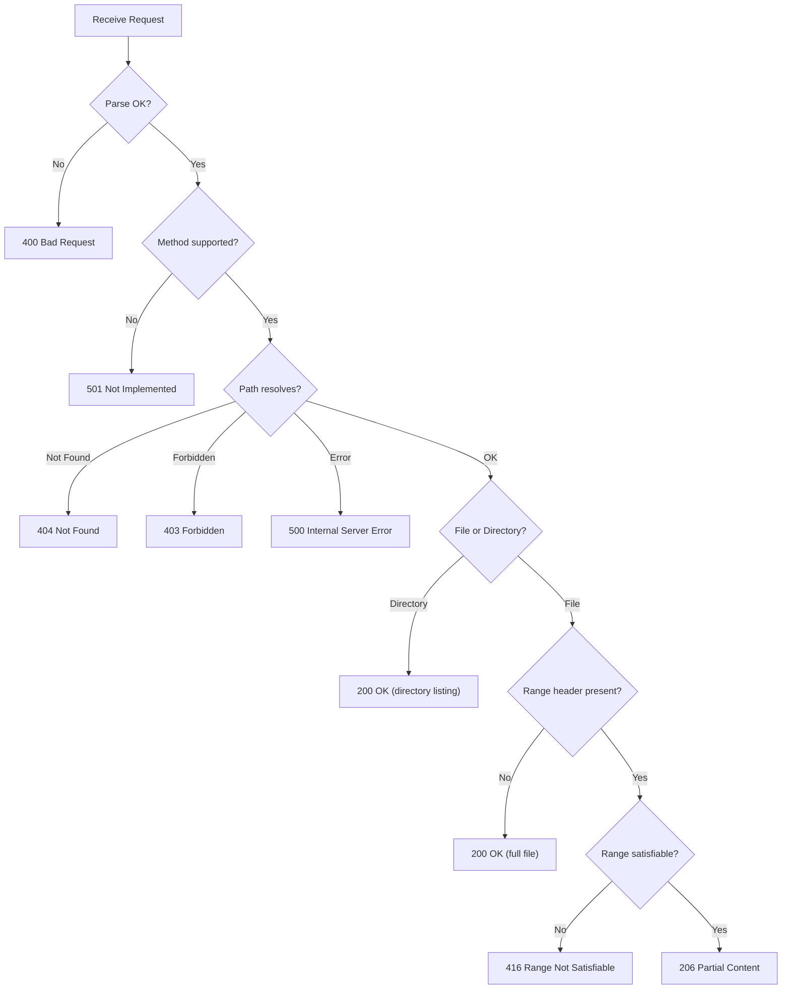

# Technical Report: Design and Implementation of a Multi-Threaded HTTP File Server in C

**Course:** System Programming — Final Project (Option A3)
**Date:** May 2026
**Language:** C11 / POSIX

---

## Abstract

This report presents the design, implementation, and evaluation of a multi-threaded HTTP file server written in C11 using the POSIX API. The server accepts TCP connections, parses HTTP/1.0 and HTTP/1.1 requests, serves static files from a configurable document root, generates HTML directory listings, supports byte-range requests for partial content delivery, and records every completed request in the Common Log Format. Concurrency is achieved through a fixed-size thread pool backed by a bounded producer-consumer queue implemented as a circular buffer with mutex and condition variable synchronization. The filesystem layer employs a five-stage path validation pipeline — URL decoding, dot-dot segment rejection, path joining, canonical resolution via `realpath(3)`, and chroot-style prefix verification — to defend against path traversal attacks. The project is validated through 16 unit tests covering the HTTP parser, filesystem resolver, and thread pool queue, complemented by 15 integration tests exercising the running server with `curl` and `netcat`, and a concurrent benchmark that confirms zero failures under 120 simultaneous clients. This report describes the theoretical background, architectural decisions, implementation details, security considerations, testing methodology, and performance characteristics of the server, and concludes with a discussion of limitations and directions for future work.

---

## Table of Contents

1. [Introduction](#1-introduction)
2. [Background and Theoretical Foundations](#2-background-and-theoretical-foundations)
3. [System Architecture and Design](#3-system-architecture-and-design)
4. [HTTP Protocol Implementation](#4-http-protocol-implementation)
5. [Thread Pool and Concurrency Architecture](#5-thread-pool-and-concurrency-architecture)
6. [File System Layer and Security](#6-file-system-layer-and-security)
7. [Access Logging Subsystem](#7-access-logging-subsystem)
8. [HTTP Range Request Support](#8-http-range-request-support)
9. [Testing and Validation Strategy](#9-testing-and-validation-strategy)
10. [Performance Analysis and Benchmarking](#10-performance-analysis-and-benchmarking)
11. [Conclusion and Future Work](#11-conclusion-and-future-work)
12. [References](#12-references)
13. [Appendices](#13-appendices)

---

## 1. Introduction

### 1.1 Problem Statement

Modern web infrastructure is built upon HTTP servers — programs that listen for incoming TCP connections, parse textual HTTP requests, and return structured responses containing status codes, headers, and content bodies. Production-grade servers such as Apache httpd and Nginx have evolved over more than two decades to include sophisticated features including TLS termination, reverse proxying, load balancing, content caching, and event-driven I/O multiplexing. Despite this complexity, the fundamental principles underlying every HTTP server remain firmly rooted in the domain of system programming: socket-based network I/O, multi-threaded or multi-process concurrency, filesystem interaction through POSIX APIs, inter-thread synchronization using mutexes and condition variables, and safe handling of untrusted input from the network.

This project implements a multi-threaded HTTP file server in the C programming language as the final project for the System Programming course. The server accepts TCP connections on a configurable port, parses both HTTP/1.0 and HTTP/1.1 requests with correct version-specific connection semantics, serves static files from a designated document root directory, generates dynamically built HTML directory listings when a directory is requested, records every completed request in the Common Log Format used by major web servers, supports byte-range requests for partial file retrieval as specified in RFC 9110, and handles concurrent clients through a fixed-size thread pool backed by a bounded producer-consumer queue. Together, these features exercise a broad cross-section of system programming topics in a single, cohesive, and realistic application.

### 1.2 Motivation and Significance

The significance of this project lies in its integration of many core system programming concepts into one functioning program. TCP/IP socket programming is exercised through the full lifecycle of connection management, from creating a listening socket with `socket()`, binding it to an address with `bind()`, marking it passive with `listen()`, accepting incoming clients with `accept()`, and exchanging data with `recv()` and `send()`, to finally closing file descriptors with `close()`. POSIX threading is exercised through the creation of a fixed pool of worker threads using `pthread_create()` and their orderly termination via `pthread_join()`. Synchronization is exercised through a `pthread_mutex_t` protecting a shared circular buffer and two `pthread_cond_t` condition variables coordinating the producer-consumer relationship between the acceptor thread and the workers. Filesystem interaction is exercised through `stat()` for metadata queries, `realpath()` for canonical path resolution, `opendir()` and `readdir()` for directory traversal, and `fopen()`, `fread()`, `fseeko()`, and `fclose()` for buffered file I/O. Signal handling is exercised through the registration of handlers for `SIGINT` and `SIGTERM` that trigger a graceful shutdown sequence coordinating all threads. Memory management is exercised through careful use of stack-allocated buffers, heap-allocated dynamic strings with `malloc()` and `realloc()`, and `memmove()` for handling partial reads in the connection buffer.

These are the same building blocks used in production network services. By implementing them from scratch without relying on high-level frameworks or libraries, the project provides hands-on understanding of how operating system interfaces compose to form a functioning, concurrent, and secure network application.

### 1.3 Project Scope and Features

The server supports both HTTP/1.0 and HTTP/1.1 request parsing with correct version-specific connection semantics, the GET and HEAD methods (with other methods returning 501 Not Implemented), persistent connections via Keep-Alive with the correct default behavior for each protocol version, static file serving with MIME type detection based on file extension, dynamically generated HTML directory listings with sorted entries and proper output encoding, single byte-range requests with 206 Partial Content and 416 Range Not Satisfiable responses conforming to RFC 9110, Common Log Format access logging with thread-safe writes and crash-safe flushing, a fixed thread pool with a bounded producer-consumer queue that applies backpressure via HTTP 503 Service Unavailable when the system is overloaded, and graceful shutdown via POSIX signal handling with coordinated thread termination. The project is validated through a comprehensive test suite comprising unit tests, black-box integration tests, and concurrent stress benchmarks.

### 1.4 Source Tree Organization

The project follows a modular directory structure designed to enforce separation of concerns. The entry point of the program resides in `src/main.c`, which is responsible for parsing command-line arguments using POSIX `getopt()`, registering signal handlers for SIGINT and SIGTERM, and invoking the server lifecycle functions. The server core in `src/server.c` handles the creation of the listening socket, the accept loop that receives incoming connections, the dispatching of client file descriptors to the thread pool queue, and the generation of HTTP responses for files, directories, and error conditions. The thread pool implementation in `src/thread_pool.c` provides the bounded socket queue as a circular buffer with mutex and condition variable synchronization, the worker thread lifecycle management, and the graceful shutdown mechanism. The HTTP parser in `src/http.c` implements strict request line and header parsing, method and version detection, Keep-Alive logic, and Range header extraction. The filesystem module in `src/files.c` provides safe path resolution through a five-stage validation pipeline, MIME type mapping from file extensions, and HTML directory listing generation with both HTML escaping for display text and URL encoding for hyperlinks. The access logging module in `src/log.c` implements thread-safe Common Log Format logging with mutex-protected writes and immediate flushing for crash safety. Each module exposes a clean public API through a corresponding header file in the `include/` directory, and internal implementation details are marked `static` to enforce encapsulation.

> **[Chèn ảnh: Ảnh chụp cấu trúc thư mục dự án (cây thư mục) trong terminal hoặc file explorer, hiển thị rõ các folder src/, include/, tests/, bench/, www/, report/]**

---

## 2. Background and Theoretical Foundations

### 2.1 The Hypertext Transfer Protocol

The Hypertext Transfer Protocol (HTTP) is an application-layer protocol that forms the foundation of data communication on the World Wide Web. Originally specified as HTTP/1.0 in RFC 1945 by Berners-Lee, Fielding, and Frystyk in 1996, and later refined as HTTP/1.1 in RFC 9112 by Fielding, Nottingham, and Reschke in 2022, the protocol operates on a request-response model over reliable TCP connections. An HTTP transaction begins when a client establishes a TCP connection to the server through the standard three-way handshake (SYN, SYN-ACK, ACK), then sends a request message consisting of a request line, a set of header fields, and an optional message body. The server processes the request and returns a response message consisting of a status line indicating success or failure, a set of response headers, and an optional response body containing the requested content. After the exchange is complete, the connection is either closed or kept alive for subsequent requests, depending on the protocol version and the presence of connection management headers.

> **[Chèn ảnh: Sơ đồ minh họa TCP three-way handshake (SYN, SYN-ACK, ACK) giữa Client và Server, theo sau là HTTP Request/Response flow trên cùng kết nối TCP]**

The request line of an HTTP message has the fixed format `Method SP Request-URI SP HTTP-Version CRLF`, where SP denotes a single space character and CRLF denotes the carriage-return line-feed sequence `\r\n`. For example, a typical request line reads `GET /index.html HTTP/1.1\r\n`. Following the request line, each header field occupies one line in the format `Header-Name: Header-Value\r\n`. The header section is terminated by an empty line (a bare CRLF), which may be followed by an optional message body. This textual, line-oriented format makes HTTP relatively straightforward to parse, but the parser must handle edge cases carefully — empty fields, missing components, unknown header names, oversized inputs, and percent-encoded characters in the URI all require explicit validation.

The two HTTP versions supported by this server differ fundamentally in their default connection management behavior. In HTTP/1.0, the connection is closed after each response unless the client explicitly includes the header `Connection: keep-alive`, in which case the server may choose to keep the connection open for additional requests. In HTTP/1.1, the connection is persistent by default; it remains open for subsequent requests unless either party sends the header `Connection: close`. This difference has significant performance implications: HTTP/1.0's default close behavior forces a new TCP three-way handshake for every request, while HTTP/1.1's persistent connections amortize the handshake cost across many requests on the same connection, reducing latency and server load. The server must correctly implement these version-specific semantics to interoperate with both older HTTP/1.0 clients and modern HTTP/1.1 clients.

### 2.2 Concurrency Models for Network Servers

Handling multiple simultaneous clients is a fundamental challenge in network server design. The simplest concurrent model, often called thread-per-connection, creates a new operating system thread for each incoming connection by calling `pthread_create()` immediately after `accept()`. While easy to implement and reason about, this approach has serious scalability drawbacks: the cost of `pthread_create()` is non-trivial (each thread requires its own stack, typically 64 KB or more by default), and under heavy load the number of threads can grow unbounded, leading to memory exhaustion, excessive context switching overhead, and eventual failure of the `pthread_create()` call itself. In production systems, a denial-of-service attack could trivially exploit this by opening thousands of connections.

The fixed thread pool model, adopted by this project, addresses these drawbacks by creating a predetermined number of worker threads at server startup and distributing incoming connections through a shared queue. The acceptor thread (typically the main thread) calls `accept()` in a loop and places each accepted client file descriptor into a bounded queue. Worker threads block on the queue until a file descriptor becomes available, then process the client's HTTP request, send the response, and return to the queue for more work. This design provides several important properties: resource usage is bounded and predictable (exactly N threads regardless of load), thread creation overhead is paid only once at startup, work is naturally distributed across workers in FIFO order, and the bounded queue provides a mechanism for backpressure when the server is overloaded. The trade-off is moderate synchronization complexity — the shared queue requires a mutex for mutual exclusion and condition variables for efficient blocking — which is a worthwhile investment given the improved robustness and predictability.

A third approach, the event-driven model using system calls such as `epoll` on Linux or `kqueue` on BSD, can handle tens of thousands of concurrent connections with very few threads by multiplexing I/O readiness notifications. While more scalable for extreme connection counts, event-driven programming is significantly more complex, requiring state machines for each connection and careful management of non-blocking I/O. This model is not adopted in the current project but is discussed as a direction for future optimization in Section 11.

> **[Chèn ảnh: Bảng so sánh trực quan giữa 3 mô hình: Thread-per-Connection, Fixed Thread Pool, và Event-Driven, có biểu đồ minh họa resource usage (memory, CPU) khi tăng số lượng client đồng thời]**

### 2.3 The Producer-Consumer Pattern and Bounded Buffers

The producer-consumer pattern is a classical concurrency design pattern in which one or more producer threads generate work items and place them into a shared buffer, while one or more consumer threads remove items from the buffer and process them. The pattern arises naturally in many systems: print spoolers (the application is the producer, the printer driver is the consumer), web servers (the acceptor produces connections, workers consume them), and message queues in distributed systems.

Correct implementation of the producer-consumer pattern requires three synchronization guarantees. First, mutual exclusion: only one thread may access the shared buffer at any given moment, preventing data races that could corrupt the buffer's internal state (head pointer, tail pointer, count). Second, blocking on empty: when a consumer finds the buffer empty, it must wait efficiently (sleeping rather than spinning in a busy loop) until a producer adds an item. Third, blocking or rejection on full: when a producer finds the buffer at capacity, it must either wait for space to become available or reject the work item with an appropriate signal. In the POSIX threading model, these guarantees are achieved through a combination of a `pthread_mutex_t` for mutual exclusion and `pthread_cond_t` condition variables for efficient waiting: a `not_empty` condition variable signals consumers that items are available, and a `not_full` condition variable signals producers that space has been freed. The condition variable wait loop must use `while` rather than `if` to protect against spurious wakeups — a well-documented behavior in POSIX where `pthread_cond_wait()` may return even without a corresponding signal.

In this project, the acceptor thread is the single producer, enqueuing accepted client socket file descriptors into the bounded queue, and the worker threads are multiple consumers, dequeuing sockets and handling the associated HTTP requests. The bounded queue is implemented as a circular buffer of integers (file descriptors) with modulo-arithmetic index wrapping, providing O(1) enqueue and dequeue operations with FIFO ordering.

### 2.4 Path Traversal Attacks and Defense-in-Depth

Path traversal, also known as directory traversal, is a well-known class of web server vulnerabilities classified as CWE-22 (Improper Limitation of a Pathname to a Restricted Directory) by the MITRE Common Weakness Enumeration. An attacker exploits this vulnerability by crafting a request URI containing `..` (parent directory) segments — or their URL-encoded equivalents `%2e%2e` — to escape the configured document root and access arbitrary files on the server's filesystem. For example, a request for `GET /../../../../etc/passwd HTTP/1.1` could, if the server naively concatenates the document root with the request path, cause the server to reveal the system's password file.

Defense against path traversal requires a defense-in-depth strategy with multiple independent mitigation layers, because any single check may be bypassed through encoding tricks, symlink manipulation, or edge cases in path normalization. This project implements five sequential validation stages: URL decoding of percent-encoded characters, string-level rejection of `..` as a path segment, concatenation of the decoded path with the document root, canonical resolution of both the document root and the target path using `realpath(3)` to eliminate symbolic links and relative components, and finally a prefix check verifying that the resolved target path begins with the resolved document root path. Each stage can independently reject the request, and a failure at any stage prevents subsequent stages from executing. This layered approach ensures that even if one stage contains a subtle bug, the remaining stages provide additional protection.

---

## 3. System Architecture and Design

### 3.1 Modular Architecture

The server is designed as a collection of focused, loosely coupled modules, each encapsulating a single area of responsibility. The entry point module (`src/main.c`) handles command-line parsing and signal registration; it knows about configuration and the server lifecycle but nothing about HTTP or filesystems. The server core module (`src/server.c`) manages the listening socket, the accept loop, and request handling; it orchestrates the other modules but delegates protocol parsing to the HTTP module, path resolution to the filesystem module, and log writing to the logging module. The HTTP parser module (`src/http.c`) is a pure function: it takes a byte buffer and produces a structured request object, with no side effects and no dependencies on other project modules. The filesystem module (`src/files.c`) handles path validation, MIME type detection, and directory listing generation, depending only on POSIX filesystem APIs. The thread pool module (`src/thread_pool.c`) provides the bounded queue and worker thread management, depending only on the POSIX threading API. The logging module (`src/log.c`) provides thread-safe log writes, depending only on `stdio` and `pthread`. This design ensures that each module can be understood, modified, and tested independently, and that dependencies flow in a single direction from higher-level modules to lower-level ones.

Each module exposes its public interface through a header file in the `include/` directory. Internal functions and data structures are declared `static`, making them invisible to other translation units and enforcing information hiding at the compiler level. This practice reduces the risk of name collisions, makes the public API surface explicit, and allows the compiler to optimize internal functions more aggressively.

### 3.2 System Architecture Overview

The overall system follows a pipeline architecture in which incoming TCP connections flow through several processing stages. An HTTP client initiates a TCP connection to the server. The acceptor thread, running the main event loop in `server_run()`, calls `accept()` to obtain a new client socket file descriptor and enqueues it into the bounded socket queue. One of the N pre-created worker threads dequeues the file descriptor, reads the HTTP request from the socket, passes the raw bytes to the HTTP parser, resolves the requested path through the filesystem module, generates the appropriate response (file content, directory listing, or error message), sends the response back to the client, writes a log entry through the logging module, and either loops back for the next request on the same connection (if Keep-Alive is active) or closes the connection and returns to the queue for a new client.

> **[Chèn ảnh: Sơ đồ kiến trúc hệ thống tổng thể vẽ đẹp bằng draw.io hoặc Figma, với các khối module có màu sắc và mũi tên thể hiện luồng dữ liệu từ Client → Accept Loop → Queue → Workers → Parser/Filesystem/Logger → Response → Client]**

### 3.3 Request Lifecycle

The complete lifecycle of an HTTP request through the server can be described as a sequence of interactions among the architectural components. The process begins when an HTTP client establishes a TCP connection to the server's listening socket. The acceptor thread, which runs the `accept()` system call in a loop, returns from `accept()` with a new file descriptor representing the client connection. This file descriptor is passed to `socket_queue_enqueue()`, which places it at the tail of the bounded circular buffer, signals the `not_empty` condition variable to wake one sleeping worker, and returns immediately to continue accepting connections. If the queue is full, `enqueue()` returns `QUEUE_FULL`, and the acceptor responds to the client with HTTP 503 Service Unavailable before closing the socket — this is the backpressure mechanism that prevents unbounded memory growth under overload.

On the consumer side, a worker thread that has been blocking on `socket_queue_dequeue()` is awakened by the `not_empty` signal. It acquires the mutex, removes the file descriptor from the head of the circular buffer, signals `not_full` in case the producer was waiting for space, releases the mutex, and begins processing the client. The worker calls `recv()` to read bytes from the socket into a stack-allocated buffer, then passes the buffer to `http_parse_request()`, which extracts the method, URI, HTTP version, Connection header, and Range header into an `http_request_t` structure. Based on the parsed request, the worker calls `file_stat_path()` to resolve the URI against the document root and determine whether the target is a regular file, a directory, or nonexistent. For regular files, the worker opens the file with `fopen()`, optionally seeks to the requested byte range with `fseeko()`, and streams the content to the client in 8 KB chunks. For directories, the worker calls `file_build_directory_listing()` to generate an HTML page with sorted, encoded entries. For errors, the worker sends an appropriate HTTP error response with the correct status code and reason phrase. After the response is fully sent, the worker calls `access_log_write()` to record the request in Common Log Format. Finally, based on the Keep-Alive determination from `http_should_keep_alive()`, the worker either loops back to `recv()` for the next request on the same connection or closes the socket and returns to the queue.

> **[Chèn ảnh: Sequence diagram minh họa vòng đời request, có thể vẽ lại đẹp hơn bằng draw.io hoặc Lucidchart, dùng các màu khác nhau cho từng participant]**

### 3.4 Configuration and Startup

The server accepts six command-line options parsed with the POSIX `getopt()` function. The `-h` option specifies the bind address (defaulting to `0.0.0.0` for all interfaces), `-p` sets the TCP port (defaulting to 8080), `-r` designates the document root directory (defaulting to `www`), `-t` controls the number of worker threads (defaulting to 4), `-q` sets the bounded queue capacity (defaulting to 64), and `-l` specifies the access log file path (defaulting to `access.log`). All integer parameters are validated through a custom `parse_positive_int()` function that uses `strtol()` with complete error checking — rejecting null pointers, empty strings, non-numeric characters, values outside the range 1 to 65535, and overflow conditions. The validated configuration is stored in a `server_config_t` structure and passed to `server_init()`, which creates the listening socket, initializes the bounded queue, opens the access log file, and starts the thread pool. After initialization, the main function registers signal handlers for `SIGINT` and `SIGTERM`, then calls `server_run()`, which enters the accept loop and does not return until a shutdown signal is received.

### 3.5 Build System

The project uses GNU Make as its build system, with a Makefile that defines targets for building, testing, and benchmarking. The compilation command uses strict compiler flags to enforce code quality: `-std=c11` enforces the C11 language standard, `-Wall -Wextra` enable comprehensive warnings, `-Werror` treats all warnings as compilation errors, and `-pedantic` enforces strict ISO C compliance. The POSIX feature test macros `-D_POSIX_C_SOURCE=200809L` and `-D_XOPEN_SOURCE=700` enable the full POSIX.1-2008 API surface, including functions such as `getaddrinfo()`, `realpath()`, `localtime_r()`, `fseeko()`, and `strndup()`. The threading library is linked via `-pthread`. The Makefile defines separate targets for unit testing (`make test-unit`), integration testing (`make test-integration`), combined testing (`make test`), and benchmarking (`make bench`), allowing each validation step to be run independently during development.

---

## 4. HTTP Protocol Implementation

### 4.1 Design Philosophy

The HTTP protocol implementation, residing entirely in `src/http.c`, provides three public functions: `http_parse_request()` for parsing a raw byte buffer into a structured request, `http_should_keep_alive()` for determining whether the connection should remain open after the response, and `http_status_text()` for mapping numeric status codes to their textual reason phrases. A deliberate design decision was made to perform all parsing without dynamic memory allocation. Every parsed field is stored in a fixed-size buffer within the `http_request_t` structure — the method text occupies at most 16 bytes, the path at most 1024 bytes, the version text at most 16 bytes, and the Connection header value at most 32 bytes. This approach eliminates the possibility of `malloc()` failures during request processing, simplifies error handling (no cleanup paths for partially allocated state), and keeps all per-request memory on the stack or in caller-provided structures.

### 4.2 Request Line Parsing

The parsing of an HTTP request line is performed by `http_parse_request()` through a sequence of strict validation steps. The function first scans the input buffer for a CRLF sequence (`\r\n`) using the internal `find_crlf()` helper, which performs a linear scan through the buffer looking for the two-byte pattern. If no CRLF is found within the buffer bounds, the request is immediately rejected as malformed with a return code of `HTTP_PARSE_BAD_REQUEST`. Once the CRLF is located, the function uses `memchr()` to find the first and second space characters within the request line, which separate the three components: method, request-URI, and HTTP version. If either space is missing, or if the method or version string would be empty (zero-length), the request is rejected.

The method component is parsed by `parse_method()`, which performs exact string comparison against `"GET"` and `"HEAD"`. If the method matches `GET`, the function returns `HTTP_METHOD_GET`; if it matches `HEAD`, it returns `HTTP_METHOD_HEAD`; any other method string — including `POST`, `PUT`, `DELETE`, `OPTIONS`, `PATCH`, and any custom method — results in `HTTP_METHOD_UNSUPPORTED`. This design ensures that the parser accepts all syntactically valid request lines without assuming a fixed set of methods, while clearly marking unsupported methods for the response handler to generate 501 Not Implemented.

The URI component is further processed to strip any query string. If the URI contains a `?` character, only the portion before the question mark is retained as the request path; the query string is discarded entirely. This simplification is appropriate because the server serves static files and directories, and query parameters have no effect on the served content. The version component is parsed by `parse_version()`, which matches the exact strings `"HTTP/1.0"` and `"HTTP/1.1"`. Any other version string, including `"HTTP/0.9"`, `"HTTP/2"`, or malformed strings like `"HTTP 1.1"`, results in `HTTP_VERSION_UNKNOWN`, which causes the overall parse to fail with `HTTP_PARSE_BAD_REQUEST`.

> **[Chèn ảnh: Sơ đồ minh họa quá trình parsing request line, chia HTTP request "GET /index.html HTTP/1.1\r\n" thành 3 phần (Method, URI, Version) bằng cách tìm space characters, có mũi tên và nhãn rõ ràng]**

### 4.3 Header Parsing and Connection Semantics

After the request line is successfully parsed, the `parse_headers()` function iterates through the remaining lines in the buffer, processing each header field until it encounters an empty line (which signals the end of the header section and the beginning of any message body). For each header line, the function locates the colon separator using `memchr()`, extracts the header name and value, trims leading and trailing whitespace from the value, and performs case-insensitive comparison of the header name against the two recognized header names: `Connection` and `Range`. The case-insensitive comparison is implemented by the `ascii_case_equal_bounded()` helper, which converts each character to lowercase using `tolower()` before comparison, conforming to RFC 9110 §5.1 which states that header field names are case-insensitive. Unrecognized headers are silently ignored, which is both correct per the HTTP specification and practical for a server that does not need to process headers such as `Host`, `User-Agent`, or `Accept-Encoding`.

The `Connection` header determines the Keep-Alive behavior of the connection, and its interpretation depends on the HTTP version. For HTTP/1.1, the connection is kept alive by default; it is closed only if the `Connection` header has the value `close` (case-insensitive). For HTTP/1.0, the connection is closed by default; it is kept alive only if the `Connection` header has the value `keep-alive` (case-insensitive). This logic is encoded concisely at the end of `http_parse_request()`: for HTTP/1.1, `keep_alive_requested` is set to the negation of `ascii_case_equal(connection, "close")`; for HTTP/1.0, it is set to `ascii_case_equal(connection, "keep-alive")`. The server echoes the appropriate `Connection` header value in every response, including `Connection: keep-alive` for persistent connections and `Connection: close` for connections that will be terminated, so that both parties agree on the connection state.

### 4.4 Safe String Handling

The HTTP parser is a security-critical component because it processes untrusted input received directly from the network. To prevent buffer overflow vulnerabilities, all string copy operations use the bounded `copy_bounded()` function, which takes an explicit destination size parameter and truncates the source if it exceeds the available space, always ensuring null termination. Memory searches use `memchr()` with explicit length bounds rather than `strchr()` on potentially unterminated strings. Formatted output uses `snprintf()` exclusively, never `sprintf()`. The Range header parser includes integer overflow protection in its `parse_size_token()` function, which checks before each multiplication that the result will not exceed `SIZE_MAX`. These practices collectively ensure that no input, regardless of its content or length, can cause the parser to write beyond allocated buffer boundaries.

### 4.5 Supported HTTP Status Codes

The server generates nine distinct HTTP status codes corresponding to different request outcomes. A 200 OK response indicates a successful file or directory response. A 206 Partial Content response indicates that a valid byte-range request was served. A 400 Bad Request response indicates that the request line or headers were malformed and could not be parsed. A 403 Forbidden response indicates that a path traversal attempt was blocked by the filesystem security layer. A 404 Not Found response indicates that the requested file or directory does not exist on disk. A 416 Range Not Satisfiable response indicates that the requested byte range could not be served because the start position exceeds the file size. A 500 Internal Server Error response indicates a system-level failure such as a file read error. A 501 Not Implemented response indicates that the request used an HTTP method other than GET or HEAD. A 503 Service Unavailable response indicates that the bounded queue is full and the server cannot accept additional clients at this time.

---

## 5. Thread Pool and Concurrency Architecture

### 5.1 Design Rationale

As discussed in Section 2.2, the project adopts a fixed thread pool model to achieve bounded resource usage, predictable performance under load, and clear demonstration of producer-consumer synchronization. The thread pool architecture consists of three interacting components: a bounded socket queue implemented as a circular buffer, a set of pre-created worker threads that dequeue and process connections, and the acceptor thread that accepts connections and enqueues file descriptors. The queue capacity and thread count are both configurable at startup, allowing operators to tune the server for different hardware capabilities and expected workloads.

### 5.2 Bounded Queue Implementation

The bounded socket queue is the central synchronization structure of the server. It is implemented as a `socket_queue_t` structure containing a dynamically allocated integer array serving as the circular buffer, `head` and `tail` indices for tracking the dequeue and enqueue positions, a `count` field tracking the number of items currently in the queue, a `capacity` field recording the maximum queue size, a `pthread_mutex_t` protecting all shared state, a `pthread_cond_t not_empty` condition variable for signaling consumers that items are available, a `pthread_cond_t not_full` condition variable for signaling producers that space has been freed, and a `shutdown` flag used to coordinate graceful termination.

> **[Chèn ảnh: Sơ đồ minh họa Circular Buffer (Bounded Queue) với head, tail, count, capacity. Vẽ dạng vòng tròn hoặc mảng tuyến tính với wrap-around arrows, thể hiện ba trạng thái: empty (head == tail, count == 0), partially full, và full (count == capacity)]**

The circular buffer uses modulo arithmetic for index wrapping, ensuring O(1) time complexity for both enqueue and dequeue operations regardless of the queue size. When an item is enqueued, it is placed at `items[tail]` and the tail index advances to `(tail + 1) % capacity`. When an item is dequeued, it is read from `items[head]` and the head index advances to `(head + 1) % capacity`. The `count` field is incremented on enqueue and decremented on dequeue, providing an O(1) check for empty and full conditions without the ambiguity inherent in head/tail comparison alone.

The enqueue operation, implemented in `socket_queue_enqueue()`, follows a non-blocking strategy. The function acquires the mutex, checks whether the queue is shut down (returning `QUEUE_CLOSED`), checks whether the queue is at capacity (returning `QUEUE_FULL`), and if space is available, places the file descriptor at the tail position, advances the tail, increments the count, signals `not_empty` to wake one waiting worker, and releases the mutex. The non-blocking design is critical: if the enqueue blocked when the queue was full, the acceptor thread would stall, preventing it from calling `accept()` to drain the kernel's TCP backlog, which could cause connection timeouts for other clients. Instead, the acceptor responds immediately with HTTP 503 Service Unavailable and closes the connection, informing the client that the server is temporarily overloaded while allowing the acceptor to continue processing other connections.

The dequeue operation, implemented in `socket_queue_dequeue()`, follows a blocking strategy. The function acquires the mutex, then enters a `while` loop that checks whether the queue is empty and not shut down; if both conditions are true, the function calls `pthread_cond_wait(&not_empty, &mutex)`, which atomically releases the mutex and puts the calling thread to sleep until another thread signals the condition variable. When the thread is awakened, the mutex is re-acquired and the `while` condition is re-checked — this is the correct pattern for handling spurious wakeups, which are a documented behavior in POSIX where `pthread_cond_wait()` may return even without a corresponding signal. If the queue is empty and the shutdown flag is set, the function returns `QUEUE_CLOSED`, causing the worker to exit its main loop. Otherwise, the function reads the file descriptor from the head position, advances the head, decrements the count, signals `not_full` to notify the producer that space is available, releases the mutex, and returns the file descriptor.

### 5.3 Backpressure Mechanism

When the acceptor thread receives `QUEUE_FULL` from the enqueue operation, it applies backpressure by immediately sending an HTTP 503 Service Unavailable response to the client with `Connection: close`, logging the event in the access log with a dash placeholder for the request line, and closing the client socket. This mechanism prevents unbounded memory growth under load, informs the client using the semantically correct HTTP status code for temporary overload, preserves fairness by continuing to process already-queued connections rather than blocking the acceptor, and keeps the acceptor non-blocking so it can continue draining the kernel's TCP backlog. The queue capacity is configurable at startup via the `-q` command-line option, allowing operators to balance between memory usage (larger queues use more memory) and overload tolerance (larger queues accept more burst traffic before triggering backpressure).

> **[Chèn ảnh: Sơ đồ minh họa Backpressure mechanism — khi queue đầy, acceptor trả về 503 Service Unavailable cho client mới và đóng kết nối, trong khi workers tiếp tục xử lý các request đã được enqueue]**

### 5.4 Worker Thread Lifecycle

Worker threads are created during server initialization by `thread_pool_start()`, which allocates a `worker_args_t` structure on the heap for each thread (containing a pointer to the shared pool), creates the thread with `pthread_create()`, and records the thread ID in a dynamically allocated array. If any thread creation fails, the function sets the pool's thread count to the number of threads successfully created and calls `thread_pool_stop()` to shut down and join the already-created threads, then returns an error code to the caller. This error handling ensures that no threads are leaked even during partial initialization failure.

Each worker thread's entry point is the `worker_main()` function, which first frees the heap-allocated `worker_args_t` structure (transferring ownership from the creator to the thread), then enters a simple loop: call `socket_queue_dequeue()` to obtain a client file descriptor, call the registered handler function (which processes the HTTP request), and repeat. When `dequeue()` returns `QUEUE_CLOSED` due to shutdown, the loop exits and the thread function returns `NULL`, allowing `pthread_join()` to reap the thread.

### 5.5 Graceful Shutdown

The graceful shutdown sequence is designed to ensure that all resources are properly released and no threads are left in an indeterminate state. When a SIGINT or SIGTERM signal is received, the signal handler sets `server->should_stop = 1` using a `volatile sig_atomic_t` field, which guarantees atomic reads and writes without requiring a mutex in the signal handler context. The signal handler then calls `server_stop()`, which closes the listening socket file descriptor. This causes the blocking `accept()` call in the acceptor loop to return with an error (`EBADF` or `EINTR`). The acceptor loop checks `should_stop`, finds it set, and exits.

Next, `socket_queue_shutdown()` is called, which acquires the mutex, sets the `shutdown` flag, calls `pthread_cond_broadcast()` on both the `not_empty` and `not_full` condition variables to wake all sleeping threads, and releases the mutex. The use of `broadcast` rather than `signal` is critical during shutdown because all waiting workers must be woken, not just one — each worker needs to see the shutdown flag and exit its loop. After the broadcast, `thread_pool_stop()` calls `pthread_join()` on each worker thread, blocking until every thread has exited. Only after all threads have been joined does the function free the thread array and return, at which point the caller can safely destroy the queue, close the access log, and free remaining resources.

### 5.6 Synchronization Correctness

The thread pool's synchronization design avoids deadlock because the system has only one mutex (the queue mutex) and no circular wait dependencies: the acceptor thread acquires the mutex briefly during enqueue and never waits for workers, while workers acquire the mutex during dequeue and never wait for the acceptor except through the condition variable, which atomically releases the mutex before sleeping. Livelock is avoided because every enqueue signals exactly one consumer and every dequeue signals the producer, ensuring that progress is made whenever items are in the queue. The `while` loop around `pthread_cond_wait()` prevents spurious wakeups from corrupting queue state, and the shutdown broadcast ensures that all threads eventually exit regardless of the order in which signals are delivered.

---

## 6. File System Layer and Security

### 6.1 Overview and Threat Model

The filesystem layer, implemented in `src/files.c`, serves as the security boundary between untrusted HTTP request URIs and the server's on-disk resources. Its primary responsibility is to take a client-supplied path string (e.g., `/images/logo.png`) and either resolve it to a verified absolute path within the document root directory or reject it with an appropriate error. This component must be implemented with extreme care because path-handling bugs in file servers are among the most common and dangerous web server vulnerabilities, potentially allowing attackers to read arbitrary files from the server's filesystem, including password files, configuration files, and application source code. The threat model assumes that the client is fully adversarial: every character in the request URI is considered untrusted input, and the filesystem module must produce correct results for all possible inputs, including paths containing `..` segments, URL-encoded special characters, symbolic links, excessively long paths, null bytes, and combinations thereof.

### 6.2 The Five-Stage Path Resolution Pipeline

Every incoming request path passes through five sequential validation stages before the server accesses any file on disk. Each stage is capable of independently rejecting the request, and a rejection at any stage prevents subsequent stages from executing. This defense-in-depth approach ensures that even if one validation stage contains a subtle bug, the remaining stages provide additional protection.

> **[Chèn ảnh: Sơ đồ flowchart thể hiện 5 giai đoạn của Path Resolution Pipeline: (1) URL Decoding → (2) Dot-Dot Rejection → (3) Path Joining → (4) realpath() Resolution → (5) Chroot Verification. Mỗi bước có nhánh "reject → 403/404" và nhánh "continue → next stage"]**

**Stage 1: URL Decoding.** HTTP URIs use percent-encoding to represent special characters: a percent sign followed by two hexadecimal digits (e.g., `%20` for a space character, `%2F` for a forward slash, `%2e` for a period). The `decode_path()` function iterates through the input string and converts each `%XY` sequence to the corresponding byte value. The decoder is intentionally strict: if the two characters following a percent sign are not valid hexadecimal digits, the function rejects the path entirely by writing a null terminator and returning. Backslash characters are also rejected, as they have no valid use in Unix paths and their presence may indicate an attacker probing for Windows-style path separators. This strictness eliminates ambiguous interpretations of malformed encodings that could be exploited to bypass later validation stages.

**Stage 2: Dot-Dot Segment Rejection.** After decoding, the path is scanned for `..` as a complete path segment. The `contains_dot_dot_segment()` function normalizes the path by stripping the leading slash, then iterates through the string checking for the pattern where two consecutive period characters are followed by either a forward slash or the null terminator. This check catches both embedded traversal segments (e.g., `/../etc/passwd`) and trailing traversal segments (e.g., `/path/..`). Critically, this string-level check runs before `realpath(3)` because `realpath()` on some operating systems may resolve `..` through symbolic links in unexpected ways, potentially producing a canonical path outside the document root even though the original input contained `..`. By rejecting `..` at the string level before any filesystem interaction occurs, the server blocks the most common traversal vectors as an early defense.

**Stage 3: Path Joining.** The decoded and validated path is joined with the configured document root using `snprintf()`, which guarantees null termination and prevents buffer overflow regardless of the input lengths. The leading slash is stripped from the request path before joining, so a request for `/index.html` with a document root of `/var/www` produces the candidate path `/var/www/index.html`.

**Stage 4: Canonical Path Resolution.** Both the document root and the candidate target path are resolved to their canonical absolute forms using `realpath(3)`. This POSIX function performs three critical operations: it resolves all symbolic links to their ultimate targets, removes all `.` (current directory) references, and resolves all `..` (parent directory) references by walking up the directory hierarchy. The result is an absolute path with no relative components and no symbolic links. If the target path does not exist on disk (or any component of the path is a broken symbolic link), `realpath()` returns `NULL` and the server returns 404 Not Found. By resolving both the document root and the target path independently, the server can compare two canonical paths without worrying about different representations of the same filesystem location.

**Stage 5: Chroot Verification.** The final and most critical security check verifies that the resolved canonical target path is within the resolved canonical document root. The function calls `strncmp()` to check that the target path begins with the document root path as a prefix. However, a simple prefix check is insufficient: if the document root is `/var/www`, the path `/var/www-extra/secret.txt` would pass a naive prefix check because it begins with the string `/var/www`. To prevent this, the function additionally checks that the character in the target path immediately after the document root prefix is either a forward slash (indicating a subdirectory) or a null terminator (indicating the path is exactly the document root). If either check fails, the function returns `FILE_RESULT_FORBIDDEN`, which triggers a 403 Forbidden response.

### 6.3 MIME Type Detection

Once a file's existence and accessibility are confirmed, the server must determine the correct Content-Type header value for the HTTP response. The `file_mime_type()` function implements this by extracting the file extension using `strrchr()` (which finds the last period in the filename, correctly handling names like `file.tar.gz` where the extension is `.gz`), then performing case-insensitive comparison against a table of known extensions using `strcasecmp()`. The function recognizes `.html` and `.htm` as `text/html`, `.txt` as `text/plain`, `.css` as `text/css`, `.js` as `application/javascript`, `.json` as `application/json`, `.png` as `image/png`, `.jpg` and `.jpeg` as `image/jpeg`, `.gif` as `image/gif`, and `.svg` as `image/svg+xml`. Any file with an unrecognized or missing extension is assigned the MIME type `application/octet-stream`, which instructs the client to treat the response as a binary download rather than attempting to render it.

### 6.4 Directory Listing Generation

When the resolved path corresponds to a directory rather than a regular file, the server dynamically generates an HTML page listing the directory's contents. This process involves reading directory entries using `opendir(3)` and `readdir(3)`, classifying each entry as a file or directory using `stat(2)` (rather than relying on the `d_type` field of `struct dirent`, which may be `DT_UNKNOWN` on some filesystems such as NFS or certain network-mounted volumes), sorting the entries using `qsort()` with a custom comparator that places directories before files and orders entries alphabetically within each group, and building the HTML response string.

The HTML construction requires two distinct encoding operations applied to each filename. For the visible display text of each entry, HTML escaping is applied: the characters `<`, `>`, `&`, and `"` are replaced with their HTML entity equivalents (`&lt;`, `&gt;`, `&amp;`, `&quot;`) to prevent Cross-Site Scripting (XSS) attacks. A filename such as `` is rendered as literal text in the browser rather than being interpreted as executable JavaScript. For the `href` attribute of each hyperlink, URL encoding is applied: characters that are not safe in URLs (spaces, punctuation, non-ASCII characters) are replaced with their percent-encoded equivalents (e.g., a space becomes `%20`, a hash becomes `%23`). These two encoding operations serve different purposes — HTML escaping protects the rendering context, while URL encoding protects the URL context — and both are necessary because a filename may contain characters that are problematic in either context.

The HTML response body is assembled using a dynamic string builder (`string_builder_t`) that maintains a heap-allocated buffer with a length and capacity, and doubles the capacity on reallocation. This approach provides amortized O(1) append operations, avoiding the O(n²) performance that would result from repeatedly calling `realloc()` with exactly the needed size. The final HTML includes a title element showing the requested path, the complete list of directory entries as clickable hyperlinks (with trailing slashes appended to directory names), and a parent-directory link when the current directory is not the document root.

> **[Chèn ảnh: Ảnh chụp màn hình trình duyệt hiển thị một directory listing HTML được server tạo ra, với danh sách file/folder có link, icon phân biệt file/folder, và breadcrumb path ở trên]**

### 6.5 Security Summary

The filesystem layer implements a comprehensive, multi-layered defense against web server vulnerabilities. Path traversal via `..` segments is blocked at the string level before any filesystem interaction and again at the canonical path level after `realpath()` resolution. Symbolic link escape is prevented by `realpath()` resolution combined with chroot-style prefix verification. Invalid URL encoding is rejected at the first stage of the pipeline through strict hexadecimal digit validation. Backslash characters are explicitly rejected as a defensive measure against cross-platform path manipulation. Cross-Site Scripting in directory listings is prevented by HTML-escaping all displayed filenames. Broken URLs in directory listing links are prevented by URL-encoding all `href` attribute values. The combination of these mitigations ensures that the filesystem layer is resilient against the attack vectors catalogued in CWE-22, CWE-59, CWE-79, and CWE-116.

---

## 7. Access Logging Subsystem

### 7.1 Common Log Format Specification

The access logging module, implemented in `src/log.c`, writes one log entry per completed HTTP request in the Common Log Format (CLF), a standard that originated with the NCSA httpd server in the early 1990s and was subsequently adopted by virtually every major HTTP server including Apache, Nginx, and IIS. Each log line follows the format `host ident authuser [timestamp] "request" status bytes`, where `host` is the client's IP address obtained from the TCP connection, `ident` and `authuser` are placeholder fields (set to dashes `-` because this server does not implement the ident protocol or HTTP authentication), `timestamp` is the local date and time in the format `dd/Mon/yyyy:HH:mm:ss +zzzz`, `request` is the complete HTTP request line as received from the client, `status` is the numeric HTTP response status code, and `bytes` is the number of bytes in the response body (excluding headers).

A typical log entry reads: `127.0.0.1 - - [10/Oct/2026:13:55:36 +0000] "GET /index.html HTTP/1.1" 200 232`. This format is chosen because it is universally understood by log analysis tools such as AWStats, GoAccess, and Webalizer, and because its simplicity makes it straightforward to implement without introducing complex formatting dependencies.

### 7.2 Thread-Safety Architecture

Because the server uses a thread pool in which multiple worker threads process requests concurrently, the logging function must be thread-safe. Without synchronization, simultaneous `fprintf()` calls from different threads would produce garbled, interleaved output — a classic data race on the FILE stream's internal buffer. The implementation addresses this through a `pthread_mutex_t` embedded in the `access_log_t` structure alongside the `FILE*` pointer. The `access_log_write()` function performs timestamp formatting outside the mutex (since `localtime_r()` and `strftime()` write to thread-local stack buffers and are therefore safe to call concurrently), then acquires the mutex, calls `fprintf()` to write the formatted log line, calls `fflush()` to force the buffered data to the kernel, and releases the mutex.

The use of `localtime_r()` rather than `localtime()` is a deliberate thread-safety measure. The standard `localtime()` function returns a pointer to a static `struct tm` shared across all threads, creating a data race when multiple threads call it concurrently. The reentrant variant `localtime_r()` writes its result into a caller-supplied buffer on the stack, eliminating the shared state.

The `fflush()` call inside the mutex is critical for crash safety. Standard C output is buffered: the default buffering mode for `fopen()` with append mode is fully buffered, meaning `fprintf()` may only copy the formatted string into a user-space buffer and return immediately without performing any I/O. If the server process crashes or is killed before the buffer is flushed, the last few log entries would be silently lost. By calling `fflush()` inside the critical section, every successful `access_log_write()` call guarantees that the log line has been delivered to the operating system kernel's write buffer before the mutex is released. This makes the logging effectively synchronous: a completed log write is durable against process crashes (though not necessarily against operating system crashes, which would require `fsync()`).

The trade-off of this design is performance. Each `fflush()` involves at least one system call (typically `write(2)`), which has non-trivial overhead. Under very high request rates, the combination of the mutex and the fflush could become a throughput bottleneck. An alternative design would use line-buffered mode (configured via `setvbuf(log->file, NULL, _IOLBF, 0)`), which automatically flushes at each newline character, providing slightly lower crash-safety guarantees but better performance. Another alternative would be per-worker log buffers that are periodically flushed to a central file, eliminating mutex contention at the cost of additional complexity. These alternatives are discussed as potential optimizations in Section 11.

> **[Chèn ảnh: Ảnh chụp nội dung file access.log sau khi chạy server và gửi nhiều loại request khác nhau (GET, HEAD, 404, 403), thể hiện nhiều dòng log theo CLF format với các status code khác nhau]**

### 7.3 Integration with Request Handling

The logging call is placed after the response is fully sent to the client, which ensures that the logged status code and byte count reflect the actual outcome of the request rather than the intended outcome. If a file read fails midway through transmission, the logged entry records the error status rather than a premature 200. For error responses (400, 403, 404, 500, 501, 503), the byte count is zero because no meaningful content body is sent. For malformed requests that cannot be parsed at all, the request line in the log entry is replaced with `<invalid request>` or a dash, preserving the CLF structure while indicating that the original request was unparsable.

---

## 8. HTTP Range Request Support

### 8.1 Motivation and Protocol Background

HTTP Range requests, specified in RFC 9110 Section 14.1, allow a client to request only a portion of a file's content rather than the entire file. This capability is essential for several practical use cases: resumable downloads (if a large download is interrupted, the client can request only the remaining bytes rather than restarting from the beginning), media streaming (video and audio players seek to arbitrary positions within a file by requesting specific byte ranges), and bandwidth optimization (a client that already has part of a file needs only the missing portion). The `Range` header uses the format `Range: bytes=start-end`, where byte positions are zero-indexed and inclusive on both ends. The server responds with HTTP 206 Partial Content when the range is satisfiable, or HTTP 416 Range Not Satisfiable when the requested range cannot be served.

### 8.2 Range Header Parsing

The Range header is parsed by the `parse_range_header()` function in `src/http.c`, which is called from the header iteration loop when a header with the name `Range` is encountered. The function first validates that the header value begins with the prefix `bytes=`, as the server supports only the `bytes` range unit (the only unit registered with IANA for HTTP). If the prefix is missing, the Range header is silently ignored and the server serves the full file. Next, the function checks for the presence of a comma in the range specification, which would indicate a multi-range request (e.g., `bytes=0-10, 20-30`). Multi-range requests are intentionally not supported because they require generating a `multipart/byteranges` response body with MIME boundary delimiters, which adds significant complexity for a feature that is rarely used in practice. If a comma is found, the Range header is ignored and the full file is served.

The function then distinguishes between two range forms. In the explicit range form (`bytes=start-end`), both the start and end byte positions are provided as decimal integers, and the server will serve bytes from `start` to `end` inclusive. In the suffix range form (`bytes=-N`), only the suffix length is provided, and the server will serve the last N bytes of the file. The distinction is made by checking whether the dash character is the first character of the range specification: if it is, the form is a suffix range; otherwise, it is an explicit range. Integer values are parsed by the `parse_size_token()` helper, which includes overflow protection: before each multiplication by 10, it checks that the intermediate result will not exceed `SIZE_MAX`, preventing integer overflow for extremely large numeric values.

### 8.3 Range Resolution Against File Size

The parsed range values are relative to the beginning or end of the file, but the actual byte positions to serve depend on the file's current size. The range resolution logic in `src/server.c` maps the parsed range against the file size to produce absolute start and end byte positions, the number of bytes to send, and a flag indicating whether the response should be partial (206) or full (200).

When no Range header is present, the resolution produces a full-file response: start is 0, end is `file_size - 1`, length is `file_size`, and the partial flag is unset. For a suffix range (`bytes=-N`) where N is less than or equal to the file size, the start position is computed as `file_size - N`, the end is `file_size - 1`, and the response is marked as partial. If N exceeds the file size, the start position is clamped to 0, effectively serving the entire file as a partial response (this conforms to RFC 9110's specification that suffix ranges exceeding the file size should serve from the beginning). For an explicit range (`bytes=start-end`), the end position is clamped to `file_size - 1` if it exceeds the file size, conforming to RFC 9110's statement that "if the last-byte-pos value is absent, or if the value is greater than or equal to the current length of the representation data, the byte range is interpreted as the remainder of the representation." If the start position is greater than or equal to the file size, the range is unsatisfiable and the resolution sets an error flag that triggers a 416 response.

### 8.4 Response Generation

When the range resolution produces a partial response, the server responds with HTTP 206 Partial Content and includes three mandatory headers in addition to the standard response headers. The `Content-Range` header has the format `bytes start-end/total`, where `start` and `end` are the inclusive byte positions of the served range and `total` is the complete file size, informing the client of both the served portion and the file's full extent. The `Content-Length` header is set to the range length (not the file size), telling the client exactly how many body bytes to expect. The `Accept-Ranges: bytes` header is included in all successful file responses (both 200 and 206) to advertise the server's range support to clients that may wish to make range requests in the future.

When the range is unsatisfiable, the server responds with HTTP 416 Range Not Satisfiable and includes the header `Content-Range: bytes */total`, where the asterisk indicates that no range is being served and `total` communicates the file's actual size, allowing the client to construct a valid range for a subsequent retry. The response body is empty.

### 8.5 File Streaming with Seek

Range requests require reading from an arbitrary position within a file rather than from the beginning. The server uses `fseeko()` to position the file pointer to the resolved start byte before beginning the read loop. The choice of `fseeko()` over `fseek()` is deliberate: `fseeko()` accepts an `off_t` offset (typically 64 bits on modern systems), while `fseek()` accepts a `long` offset (potentially 32 bits on some platforms), making `fseeko()` necessary for correct operation with files larger than 2 GB on 32-bit systems. After seeking, the server enters a streaming loop that reads up to 8192 bytes at a time from the file using `fread()`, sends each chunk to the client using a `send_all()` helper that loops around `send()` to handle partial sends, and decrements a remaining-byte counter until all bytes in the requested range have been transmitted. This chunk-based streaming approach ensures that the server never needs to load an entire file into memory, making it safe for serving files of any size limited only by the filesystem.

> **[Chèn ảnh: Sơ đồ minh họa quá trình Range Request — Client gửi "Range: bytes=7-10" cho file 100 bytes, Server dùng fseeko() để seek đến byte 7, đọc 4 bytes vào buffer 8KB, gửi 206 Partial Content với Content-Range: bytes 7-10/100]**

---

## 9. Testing and Validation Strategy

### 9.1 Testing Philosophy and Methodology

The project employs a three-layer testing strategy inspired by the testing pyramid model commonly used in software engineering. At the base of the pyramid, a large number of fast, isolated unit tests verify the correctness of individual functions in the HTTP parser, filesystem module, and thread pool queue. In the middle layer, a smaller number of end-to-end integration tests exercise the complete server by sending real HTTP requests and verifying the responses. At the apex, a concurrent benchmark validates performance and reliability under realistic load conditions. This layered approach provides both the rapid feedback needed during development (unit tests execute in milliseconds) and the confidence that the complete system functions correctly as an integrated whole (integration tests and benchmarks exercise the full code path from TCP connection to HTTP response).

> **[Chèn ảnh: Sơ đồ Testing Pyramid với 3 tầng: Unit Tests (đáy, 16 tests, nhanh nhất), Integration Tests (giữa, ~16 test cases), Benchmark (đỉnh, 120 concurrent clients). Kèm mô tả ngắn cho mỗi tầng]**

The project uses a custom lightweight test framework rather than an external library such as CUnit or Check. The framework consists of two assertion macros: `ASSERT_TRUE(condition, message)`, which increments a failure counter and prints the message if the condition is false, and `ASSERT_STR_EQ(actual, expected, message)`, which compares two strings and reports both the expected and actual values on failure. Each test module is compiled into a separate binary that returns exit code 0 if all assertions pass and exit code 1 if any assertion fails. This design has zero external dependencies, provides clear and informative failure messages, and integrates naturally with Make-based build systems where a non-zero exit code indicates failure.

### 9.2 Unit Test Coverage

The HTTP parser unit tests (`tests/unit_http.c`) exercise eight distinct scenarios. A test for HTTP/1.1 GET requests verifies that the parser correctly identifies the GET method and sets the Keep-Alive flag to true, reflecting HTTP/1.1's default persistent connection behavior. A test for HTTP/1.0 HEAD requests with an explicit `Connection: keep-alive` header verifies that the parser correctly overrides HTTP/1.0's default close behavior. A test for unsupported methods verifies that a POST request is parsed successfully but marked as `HTTP_METHOD_UNSUPPORTED`, ensuring that the parser does not confuse unsupported methods with malformed requests. A test for the `Connection: close` header verifies that an HTTP/1.1 request with this header correctly disables Keep-Alive. A test for query string stripping verifies that the path `/index.html?cache=false` is stored as `/index.html` without the query string. Two tests for Range header parsing verify that the explicit form `bytes=7-10` produces `range_start=7, range_end=10, range_is_suffix=0` and that the suffix form `bytes=-5` produces `range_start=5, range_is_suffix=1`.

The filesystem unit tests (`tests/unit_files.c`) exercise six scenarios covering MIME type detection (verifying that `.html` maps to `text/html`, `.css` maps to `text/css`, and unknown extensions map to `application/octet-stream`), path resolution under the document root (verifying that `/index.html` resolves to the correct path within the `www` directory), path traversal rejection (verifying that both `/../etc/passwd` and the URL-encoded variant `/%2e%2e/etc/passwd` are rejected as forbidden), and directory listing generation (verifying that the generated HTML contains the expected entries with properly URL-encoded links and human-readable display names).

The thread pool unit tests (`tests/unit_thread_pool.c`) exercise two critical concurrency properties. The FIFO ordering test enqueues multiple items into the queue and verifies that they are dequeued in the same order, confirming that the circular buffer maintains first-in-first-out semantics. The shutdown wakeup test creates a consumer thread that blocks on an empty queue, then calls `socket_queue_shutdown()` from the main thread and verifies that the consumer thread exits without deadlock — this confirms that the shutdown broadcast mechanism correctly unblocks all waiting threads.

### 9.3 Integration Test Architecture

The integration test script (`tests/run_tests.sh`) provides end-to-end validation of the complete server. The script starts the server as a background process, waits for it to become ready by polling with `curl` in a loop with 100ms intervals (handling the variable startup latency without arbitrary fixed delays), runs a sequence of `curl` commands that exercise different HTTP features, checks each response against expected behavior using `grep` and exit code assertions, and finally terminates the server process. A `trap` command ensures the server is killed even if the script exits abnormally due to an assertion failure.

The integration tests cover serving an existing file with 200 OK and verifying the body content, stripping query strings and confirming the same content is returned, HEAD responses returning 200 OK with no body, 404 Not Found for non-existent files, 403 Forbidden for path traversal attempts using `../`, correct CSS MIME type in the Content-Type header, directory listing generation with HTML content, URL encoding of special characters in directory listing links, retrieval of files with URL-encoded names (e.g., `space%20name.txt`), 501 Not Implemented for POST requests, 206 Partial Content for valid byte-range requests, 416 Range Not Satisfiable for unsatisfiable ranges, Keep-Alive connection reuse (verified using `netcat` to send two pipelined requests over a single TCP connection), access log verification (confirming that a CLF-formatted entry appears in the log file after a request), and concurrent stress testing with 120 simultaneous clients.

The Keep-Alive test deserves special mention because it uses `netcat` rather than `curl`. The `curl` utility opens a new TCP connection for each request by default, making it unsuitable for testing persistent connections. Netcat provides raw socket-level control, allowing the test to send two complete HTTP request messages over a single TCP connection and verify that both responses are received in the output, confirming that the server correctly maintained the persistent connection between requests.

> **[Chèn ảnh: Ảnh chụp terminal chạy `make test` thành công, hiển thị output từ unit tests (tên mỗi test + PASS) và integration tests (tên mỗi test case + PASS), kết thúc bằng "All tests passed"]**

---

## 10. Performance Analysis and Benchmarking

### 10.1 Benchmark Design

The benchmark script (`bench/bench.sh`) measures the server's throughput and reliability under concurrent load. The script accepts four parameters: the host address (defaulting to `127.0.0.1`), the port (defaulting to 18080), the request path (defaulting to `/index.html`), and the number of concurrent clients (defaulting to 120). It records the start time in milliseconds using `date +%s%3N`, spawns the specified number of clients as independent background subshell processes (each executing `curl --max-time 5 -s -o /dev/null` and writing the exit code to a temporary file), waits for all background processes to complete using the `wait` builtin, records the end time, and computes the elapsed time, success count, failure count, and approximate requests per second. Each client runs as a separate OS process with its own `curl` invocation, ensuring true concurrency rather than multiplexed or sequential requests. The `--max-time 5` flag ensures that any client that does not receive a response within 5 seconds is counted as a failure rather than hanging indefinitely.

### 10.2 Results and Analysis

The benchmark was executed with the following configuration: 8 worker threads, queue capacity 128, and 120 concurrent `curl` clients fetching `/index.html` from the document root. Under these conditions, all 120 clients completed successfully with zero failures, confirming that the thread pool and bounded queue correctly handle concurrent load that exceeds the thread count. The total elapsed time was approximately 1050 milliseconds, yielding a throughput of roughly 114 requests per second.

> **[Chèn ảnh: Ảnh chụp terminal chạy `make bench` hiển thị kết quả benchmark — số successes: 120, failures: 0, elapsed time: ~1050ms, requests per second: ~114]**

Several factors contribute to the observed throughput characteristics. The primary bottleneck is file I/O: each request requires at least three system calls (`stat()` for metadata, `fopen()` for opening the file, `fread()` for reading content) plus additional calls for writing the response and closing the file. These system calls involve context switches between user mode and kernel mode, each of which has a cost on the order of microseconds. A secondary bottleneck is queue contention: the single mutex protecting the bounded queue creates a serialization point, and under high concurrency, threads briefly compete for the lock during enqueue and dequeue operations. A third bottleneck is the access log mutex, which serializes all log writes across all worker threads and includes a `fflush()` system call inside the critical section.

The fixed thread pool design provides bounded and predictable resource usage: exactly N threads (configured with `-t`), queue memory proportional to the configured capacity, approximately 64 KB of stack per thread (the default `pthread_create` stack size), and a maximum concurrent connection capacity equal to the thread count plus the queue capacity. This predictability is a fundamental advantage over thread-per-connection designs, where resource consumption grows linearly with the number of connected clients and can reach unbounded levels under adversarial conditions.

### 10.3 Potential Optimizations

Several optimizations could significantly improve throughput for production use. The `sendfile(2)` system call could bypass user-space buffer copies entirely by instructing the kernel to transfer file data directly from the page cache to the socket buffer, eliminating two memory copies per request. Per-worker log buffering could replace the global log mutex with thread-local buffers that are periodically flushed, reducing contention to brief periodic intervals. An event-driven I/O model using `epoll(7)` could handle thousands of idle Keep-Alive connections with very few threads, avoiding the current limitation where each active Keep-Alive connection ties up a worker thread even during idle periods. Configurable socket timeouts would prevent idle Keep-Alive connections from monopolizing worker threads indefinitely. These optimizations are left as directions for future work, as the current implementation prioritizes clarity and correctness over maximum performance.

---

## 11. Conclusion and Future Work

### 11.1 Summary of Contributions

This project successfully demonstrates a realistic concurrent network server in C that integrates a comprehensive set of system programming concepts into a single, functioning application. The server correctly handles TCP socket lifecycle management from creation through acceptance, data exchange, and closure. It implements HTTP/1.0 and HTTP/1.1 request parsing with correct version-specific Keep-Alive semantics and strict input validation. Its thread pool architecture provides bounded, predictable resource usage through a producer-consumer queue with mutex and condition variable synchronization, including backpressure via HTTP 503 when the system is overloaded. The five-stage path resolution pipeline provides defense-in-depth against path traversal vulnerabilities, combining string-level checks, canonical path resolution, and chroot-style prefix verification. The RFC 9110-compliant byte-range support enables partial content delivery with correct handling of explicit ranges, suffix ranges, and unsatisfiable ranges. The thread-safe access logging subsystem provides crash-safe Common Log Format output using mutex-protected writes with immediate flushing. The comprehensive test suite — comprising 16 unit tests, 15 integration tests, and a 120-client concurrent benchmark — validates both correctness and reliability under load.

The modular architecture with clean boundaries between the HTTP parser, filesystem resolver, thread pool, server core, and logging module demonstrates separation of concerns and allows each component to be understood, tested, and maintained independently. The strict compilation flags (`-Wall -Wextra -Werror -pedantic`) and consistent use of safe string operations (`snprintf`, bounded copies, overflow checks) reflect a commitment to code quality and security.

### 11.2 Limitations

The current implementation has several intentional limitations appropriate for the project's educational scope. The server does not support TLS/HTTPS, leaving all communication in plaintext. Only HTTP/1.0 and HTTP/1.1 are supported, with no provision for HTTP/2 or HTTP/3. Files are re-read from disk for every request without caching, which is inefficient for frequently accessed files. Response compression (gzip, brotli) is not implemented. Multi-range requests are not supported, avoiding the complexity of multipart MIME responses. The server provides no authentication mechanism. All I/O is blocking, meaning each worker thread can handle only one connection at a time and is idle during periods of client inactivity on Keep-Alive connections.

### 11.3 Directions for Future Work

Several enhancements could extend the server toward production readiness. At low complexity, the `sendfile(2)` system call could eliminate user-space buffer copies for file serving, configurable socket timeouts could prevent idle connections from monopolizing worker threads, and HTTP Date headers could be added to responses for RFC compliance. At medium complexity, per-worker log buffering could reduce logging contention, multi-range response support could enable more efficient partial content delivery, and conditional request support (`If-Modified-Since` with 304 Not Modified) could reduce bandwidth usage for cached content. At high complexity, an event-driven I/O architecture using `epoll(7)` or `kqueue` could handle tens of thousands of concurrent connections, and TLS integration using OpenSSL or LibreSSL could enable secure communication. Each of these enhancements would deepen the system programming knowledge exercised by the project while bringing the server closer to production-grade capabilities.

---

## 12. References

1. Berners-Lee, T., Fielding, R., & Frystyk, H. (1996). Hypertext Transfer Protocol -- HTTP/1.0. RFC 1945. Internet Engineering Task Force. https://www.rfc-editor.org/rfc/rfc1945

2. Fielding, R., Nottingham, M., & Reschke, J. (2022). HTTP/1.1. RFC 9112. Internet Engineering Task Force. https://www.rfc-editor.org/rfc/rfc9112

3. Fielding, R., Nottingham, M., & Reschke, J. (2022). HTTP Semantics. RFC 9110. Internet Engineering Task Force. https://www.rfc-editor.org/rfc/rfc9110

4. IEEE & The Open Group. (2018). The Open Group Base Specifications Issue 7, 2018 edition (POSIX.1-2017). https://pubs.opengroup.org/onlinepubs/9699919799/

5. Kerrisk, M. (2010). *The Linux Programming Interface: A Linux and UNIX System Programming Handbook*. No Starch Press.

6. Stevens, W. R., Fenner, B., & Rudoff, A. M. (2004). *UNIX Network Programming, Volume 1: The Sockets Networking API* (3rd ed.). Addison-Wesley.

7. Butenhof, D. R. (1997). *Programming with POSIX Threads*. Addison-Wesley.

8. MITRE Corporation. (2023). CWE-22: Improper Limitation of a Pathname to a Restricted Directory ('Path Traversal'). https://cwe.mitre.org/data/definitions/22.html

9. Tanenbaum, A. S., & Bos, H. (2015). *Modern Operating Systems* (4th ed.). Pearson.

10. GNU Make Manual. https://www.gnu.org/software/make/manual/

11. Linux man pages: `socket(2)`, `bind(2)`, `listen(2)`, `accept(2)`, `recv(2)`, `send(2)`, `pthread_create(3)`, `pthread_mutex_lock(3)`, `pthread_cond_wait(3)`, `realpath(3)`, `stat(2)`, `opendir(3)`, `fseeko(3)`, `signal(2)`, `sendfile(2)`, `epoll(7)`.

---

## 13. Appendices

### Appendix A: Module Dependency Graph

The following diagram illustrates the compile-time dependency relationships between the project's modules. Dependencies flow downward from the entry point through the server core to the leaf modules, which have no internal dependencies on other project modules. This acyclic dependency structure ensures that changes to leaf modules do not cascade upward, and that each module can be compiled and tested in isolation.

> **[Chèn ảnh: Sơ đồ dependency giữa các module, vẽ bằng draw.io với các khối module có màu và mũi tên dependency rõ ràng]**

### Appendix B: HTTP Status Code Decision Tree

The following flowchart shows the decision logic that determines which HTTP status code is returned for a given request. The tree is traversed from top to bottom: first the request is parsed, then the method is checked, then the path is resolved, and finally range-specific logic determines whether the response is a full 200 or a partial 206.

> **[Chèn ảnh: Flowchart quyết định HTTP status code, vẽ đẹp bằng draw.io hoặc Figma với các nút có màu tương ứng status code (xanh cho 2xx, vàng cho 4xx, đỏ cho 5xx)]**

### Appendix C: Source Code Statistics

The server's source code comprises approximately 1,734 lines across six modules, with the server core (`server.c`) being the largest at approximately 600 lines due to its role as the integration hub connecting all other modules. The filesystem module (`files.c`) is the second largest at approximately 500 lines, reflecting the complexity of safe path resolution and directory listing generation. The HTTP parser (`http.c`) contains approximately 280 lines, the thread pool (`thread_pool.c`) approximately 200 lines, the entry point (`main.c`) approximately 94 lines, and the access logger (`log.c`) approximately 60 lines. The test code adds approximately 480 lines across three unit test files and one integration test script. The total codebase, including source, headers, tests, and build infrastructure, comprises approximately 2,200 lines — a size that is small enough to be fully understood by a single developer while large enough to demonstrate realistic modular design and inter-component interaction.

### Appendix D: Key POSIX APIs Used

The server exercises a substantial portion of the POSIX API surface relevant to network server development. For network I/O, the server uses `socket()` to create TCP sockets, `bind()` to associate sockets with addresses, `listen()` to mark sockets as passive, `accept()` to accept incoming connections, `send()` and `recv()` for data transmission, `getaddrinfo()` for address resolution, and `setsockopt()` with `SO_REUSEADDR` to allow immediate rebinding after server restart. For threading, the server uses `pthread_create()` to spawn worker threads, `pthread_join()` to wait for their completion, `pthread_mutex_lock()` and `pthread_mutex_unlock()` for mutual exclusion, and `pthread_cond_wait()`, `pthread_cond_signal()`, and `pthread_cond_broadcast()` for condition variable synchronization. For filesystem access, the server uses `realpath()` for canonical path resolution, `stat()` for file metadata queries, `opendir()`, `readdir()`, and `closedir()` for directory traversal, and `fopen()`, `fread()`, `fseeko()`, and `fclose()` for buffered file I/O. For time and logging, the server uses `localtime_r()` for thread-safe time conversion and `strftime()` for timestamp formatting. For process management, the server uses `signal()` for signal handler registration and `getopt()` for command-line argument parsing.

---

*End of Report*
