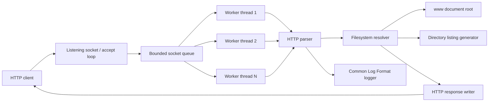
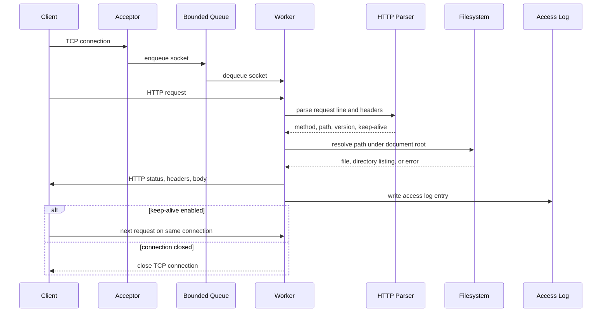

# Technical Report: Multi-Threaded HTTP File Server

## 1. Introduction

This project implements a multi-threaded HTTP file server in C for the System Programming final project. The server accepts TCP connections, parses HTTP/1.0 and HTTP/1.1 requests, serves static files from a document root, generates directory listings, records access logs, and handles concurrent clients using a fixed thread pool.

The project matters because it combines several system-programming topics in one realistic program: sockets, threads, synchronization, file I/O, input parsing, error handling, and performance testing. These are the same building blocks used in production network services, even when real deployments add more features such as TLS, caching, or reverse proxy support.

## 2. Background & Theory

HTTP is a request-response protocol. A client opens a TCP connection, sends a request line and headers, then receives a status line, headers, and optional body. HTTP/1.0 usually closes the connection after each response unless `Connection: keep-alive` is present. HTTP/1.1 keeps connections alive by default unless `Connection: close` is sent.

Concurrency is needed because one client can block while reading files or holding a connection open. This server uses a fixed thread pool instead of creating one thread per connection. A fixed pool limits resource usage, while the bounded queue applies backpressure when clients arrive faster than workers can handle them. The queue is a classic producer-consumer structure: the acceptor thread produces accepted sockets, and worker threads consume them.

Safe static file serving requires careful path handling. The server must not allow a request such as `/../etc/passwd` to escape the configured document root. This project decodes the request path, rejects `..` path segments, resolves paths with `realpath`, and checks that the final path remains under the document root.

## 3. System Design

The server is split into focused modules:

- `main`: parse command-line options and start the server.
- `server`: create the listening socket, accept clients, and handle requests.
- `thread_pool`: maintain the bounded queue and worker threads.
- `http`: parse methods, paths, versions, and connection headers.
- `files`: resolve paths, identify MIME types, stat files, and build directory listings.
- `log`: write Common Log Format access log lines safely from multiple threads.

### System Architecture



### Request Flow



## 4. Implementation

The program is written in C11 and uses POSIX APIs. The build uses `gcc` with `-Wall -Wextra -Werror -pedantic` so warnings are treated as errors.

The acceptor thread calls `accept` in a loop and enqueues client sockets. If the bounded queue is full, the socket is closed immediately. Worker threads call `socket_queue_dequeue`, process the client connection, and return to the queue for more work. Queue synchronization uses `pthread_mutex_t` and condition variables.

Request parsing is deliberately simple and strict. The parser extracts the method, path, version, and `Connection` header. It supports `GET` and `HEAD`; other methods are parsed but answered with `501 Not Implemented`. Bad request lines return `400 Bad Request`.

The filesystem module maps file extensions to MIME types and verifies that requested files remain under the configured document root. Regular files are streamed in chunks. Directories are rendered as small HTML pages listing visible entries. `HEAD` requests return headers without a response body.

The logging module writes one line per completed request in Common Log Format. It uses a mutex around file writes because multiple workers may complete requests at the same time.

## 5. Testing & Validation

The project includes unit tests and black-box integration tests.

Unit tests cover:

- HTTP parser behavior for `GET`, `HEAD`, unsupported methods, malformed requests, and Keep-Alive.
- MIME type lookup and safe path resolution.
- bounded queue FIFO behavior, full-queue behavior, and shutdown wakeup.

Integration tests cover:

- serving an existing file with `200 OK`
- `HEAD` responses
- `404 Not Found`
- `403 Forbidden` for traversal attempts
- CSS MIME type
- directory listings
- unsupported methods returning `501`
- two HTTP/1.1 requests over one Keep-Alive connection
- access log output
- 120 concurrent clients

The main validation command is:

```bash
make test
```

## 6. Performance Analysis

The benchmark script starts many concurrent clients using `curl` and reports success count, failure count, elapsed time, and approximate requests per second. A typical local run completed 120 successful requests with zero failures in under one second.

The fixed thread pool prevents unbounded thread creation. The bounded queue avoids unlimited memory growth during bursts. The largest bottlenecks are file I/O, one-thread-per-active-connection handling during Keep-Alive, and the simple access-log mutex. These trade-offs are acceptable for the project scope and make the implementation understandable and testable.

Future optimizations could include sendfile-based file transfer, per-worker log buffering, configurable socket timeouts, and an event-driven architecture for very high numbers of idle Keep-Alive clients.

## 7. Conclusion & Future Work

The project successfully demonstrates a realistic concurrent network server in C. It integrates sockets, pthreads, synchronization, HTTP parsing, filesystem safety, logging, tests, and benchmarking.

Future work could add range requests, stronger URL decoding, configurable directory-listing style, HTTP date headers, improved timeout handling, and support for larger generated directory listings.

## 8. References

- RFC 1945: Hypertext Transfer Protocol -- HTTP/1.0
- RFC 9112: HTTP/1.1
- Linux man pages: `socket`, `bind`, `listen`, `accept`, `recv`, `send`, `pthread_create`, `pthread_mutex_lock`, `realpath`, `stat`, `opendir`
- GNU Make manual
